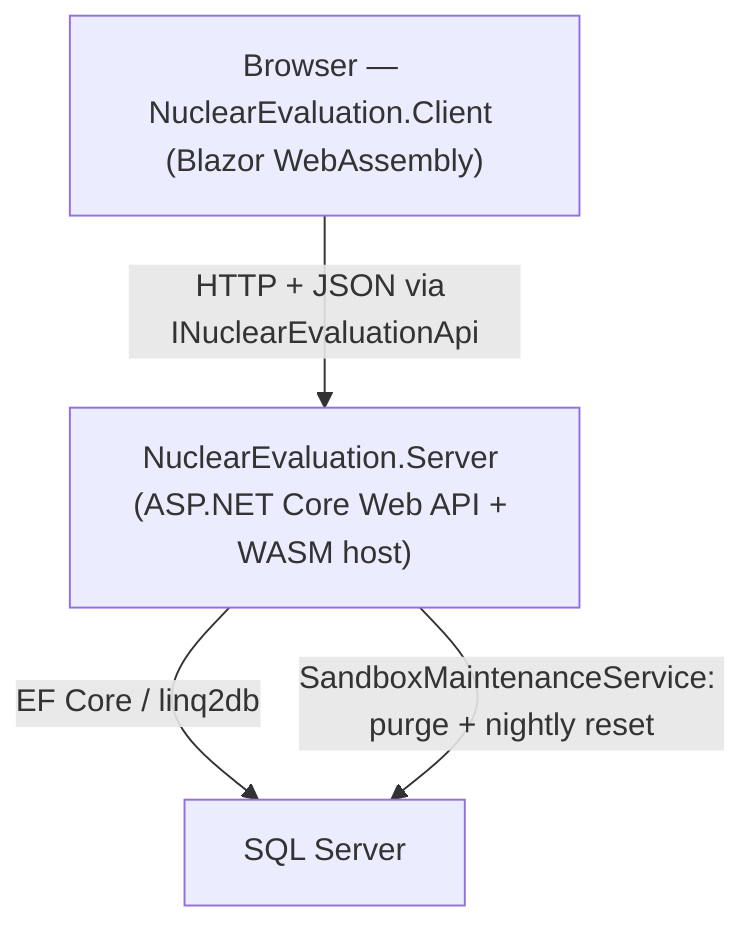

# Architecture

## System Boundaries

There is a single deployable: `NuclearEvaluation.Server` serves the compiled WASM client and
exposes the API the client calls. No SignalR circuit, no background worker processes, no message broker.

## Runtime Entry Points

- **Client**: `src/NuclearEvaluation.Client/Program.cs` — WASM host; registers `HttpClient`,
  `NuclearEvaluationApiClient`, Radzen, validators, and session cache.
- **Server**: `src/NuclearEvaluation.Server/Program.cs` — configures controllers, the rate
  limiter, the captcha gate middleware, EF Core, the sandbox hosted service, and serves the WASM
  bundle with an `index.html` fallback.

## The Client/Server Contract

`NuclearEvaluation.Shared` holds everything both sides share:

- **View models** (`SeriesView`, `SampleView`, `ApmView`, …) and domain models.
- **`DataQuery` / `DataResult<T>`** — the serializable query envelope and result. Grids convert
  Radzen `LoadDataArgs` (filter/orderby/skip/top strings) into a `DataQuery`; the server maps it
  onto a `FetchDataCommand<T>` and executes it with EF Core / dynamic LINQ.
- **`INuclearEvaluationApi`** — the full data surface. The client implements it over HTTP
  (`NuclearEvaluationApiClient`); the server implements it as controllers under `/api`.

## Data Stores

| Store | Provider | Purpose |
|---|---|---|
| SQL Server | EF Core 9 (SqlServer) + linq2db | Domain data, PMI reports, STEM staging, sandbox state |
| Local filesystem | `NuclearEvaluationStorage/` (parent of the app dir) | Uploaded PMI/STEM files (purged on the retention schedule) |

## Database Schemas

| Schema | Contents |
|---|---|
| `DATA` | Core domain: Series, Sample, SubSample, Apm, Particle |
| `EVALUATION` | Projects, ProjectSeries joins, PMI reports + file metadata, preset filters |
| `STAGING` | Per-session STEM preview rows and file metadata (ephemeral) |
| `DBO` | EF migration history, `SandboxState` |

## Key Entity Relationships

- **Project** owns **Series** (via ProjectSeries join), which own **Samples**, which own
  **SubSamples**, **Apms**, and **Particles**.
- **PmiReport** has one **PmiReportFileMetadata** and an `UploadedAt` timestamp used for retention.
- **PresetFilter** has many **PresetFilterEntry** (cascade delete); other FKs default to Restrict.
- **StemPreviewEntry** / **StemPreviewFileMetadata** are keyed by an anonymous `StemSessionId`.

## API Surface (`/api`)

| Route group | Purpose |
|---|---|
| `views/*` | Grid data for each entity (POST `DataQuery`), series counts, enum filter options |
| `series`, `projects`, `preset-filters` | CRUD / mutations |
| `charts/*` | Uranium bin counts for APM and particle charts |
| `pmi-reports` | Upload (multipart), download, name availability |
| `stem/*` | STEM preview file upload/delete |
| `captcha/*` | Proof-of-work challenge, verify, status |

## Cross-cutting Concerns

- **Captcha gate** (`CaptchaGateMiddleware`) requires a valid proof-of-work cookie on every
  `/api/*` call except `/api/captcha/*`.
- **Rate limiting** partitions by client IP: a global window plus a stricter daily upload cap.
- **Sandbox** (`SandboxMaintenanceService`) purges expired uploads and resets the DB to seed on
  a configurable interval, tracked in `DBO.SandboxState`.

## Architectural Patterns

- **linq2db** (`LinqToDBForEFTools`) is initialised at startup for bulk-copy of STEM rows.
- **DbServiceBase** centralises query execution (filter/sort/page, query-builder joins).
- **ValidatedControlBase** is the Blazor base class for form controls with FluentValidation;
  uniqueness checks call the API rather than the database directly.
